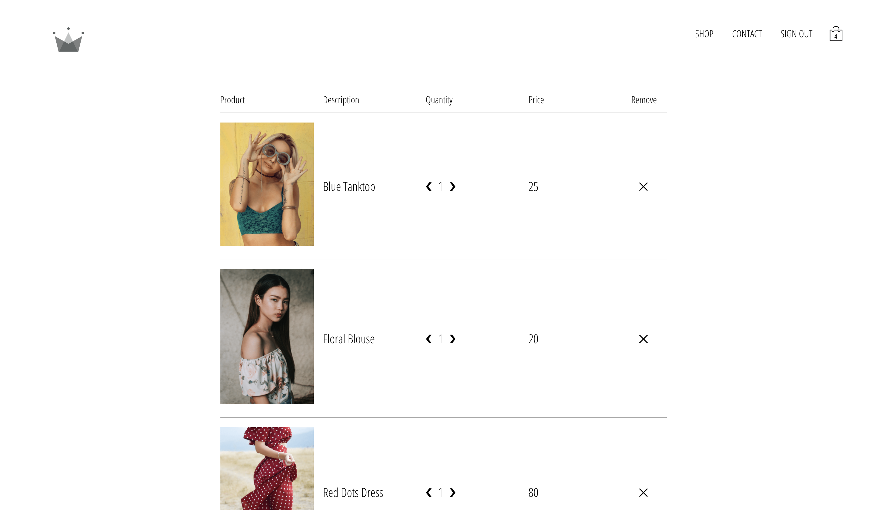

# React-Web-Store

Dynamic web store app that allows users to purchase items, add items to a cart, login/logout, and process payments.

# Technologies Used

- ReactJS
- Redux
- Firebase/Firestore
- CSS/SCSS
- Stripe API

# What I've Learned

- Advanced Redux patterns (Selectors, Memoization)
- Use of Higher Order Components (HOC) in ReactJS
- Session Storage/Persistence
- Proper practices such as developing components that are reusable, and learning where to handle App's state.

# Images

# Test App Live

Test for yourself here: https://react-web-store.herokuapp.com/
